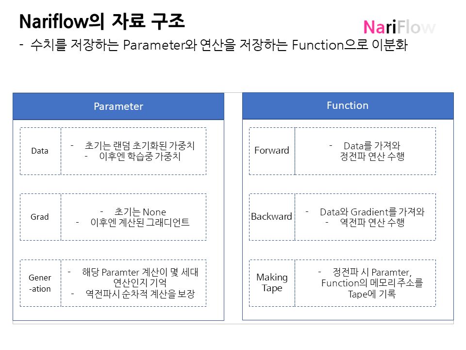

# nariflow
 
[레퍼런스](https://www.hanbit.co.kr/store/books/look.php?p_code=B6627606922, '밑바닥부터 시작하는 딥러닝3')를 기반으로 핵심 기능을 구현했습니다(Parameter, Variable, Function)

다만, nariflow는 다음의 점에서 레퍼런스에서 구현한 딥러닝 프레임워크와는 차별점이 있습니다.

1) 레퍼런스에선 다루지 않는, 현재 [텐서플로우](https://www.tensorflow.org/)에서 활용하고 있는 [GradientTape](https://www.tensorflow.org/guide/advanced_autodiff?hl=ko)을 도입하여 더 효율적인 자동미분이 가능하도록 했습니다.
2) 레퍼런스에선 다루지 않는 [야코비 행렬 출력](https://www.tensorflow.org/guide/advanced_autodiff?hl=ko#%EC%95%BC%EA%B3%A0%EB%B9%84%EC%95%88) / 헤쎄 행렬 계산 기능을 추가했습니다.
3) 레퍼런스에선 다루지 않는 선형대수 관련 기능들을 추가했습니다(Stack, Concat, Outer Product, Eigen Decomposition)

# Installtion

pip install git+https://github.com/dlanjrjs/nariflow.git

# 작동 구조 설명

# Log

2021-01-06 V1.0
최초 버전 런칭

# 구현된 기능

1. Core
- TapeGradient
- Jacobian
- StopGradient
2. Function
- Activation : sigmoid, relu, softmax
- Loss : Mean Squared Error, Categorical Crossentropy
3. Optimizer
- Adagrad
- Stochastic Gradient Descent
- Adam
4. Layer
- Linear(텐서플로우 Dense)
5. Linear Algebra
 - SVD Decomposition
 - Eigen Decomposition
 - Cholesky Decompsition
 - LQ Decomposition
 - 모든 행렬분해는 역전파 수행 가능
6. Layer
 - SimpleRNN
 - Convolutional Neural Network(CNN)

# 앞으로 구현할 기능
1. Function
- Loss : Mean Absolute Error, kullback leibler divergence loss
2. Optmizer
- RectifiedADAM
3. Layer
- SimpleRNN
4. Model
- Transformer, Bert

# Reference

M. Seeger et.al, "Auto-Differentiating Linear Algebra", 2019-08-15, https://arxiv.org/pdf/1710.08717.pdf
Magnus, Jan R. “On Differentiating Eigenvalues and Eigenvectors.” Econometric Theory 1, no. 2 (1985): 179–91. http://www.jstor.org/stable/3532409.
William W. Cohen, "Automatic Reverse-Mode Differentiation: Lecture Notes", 2016-08-17, http://www.cs.cmu.edu/~wcohen/10-605/notes/autodiff.pdf
